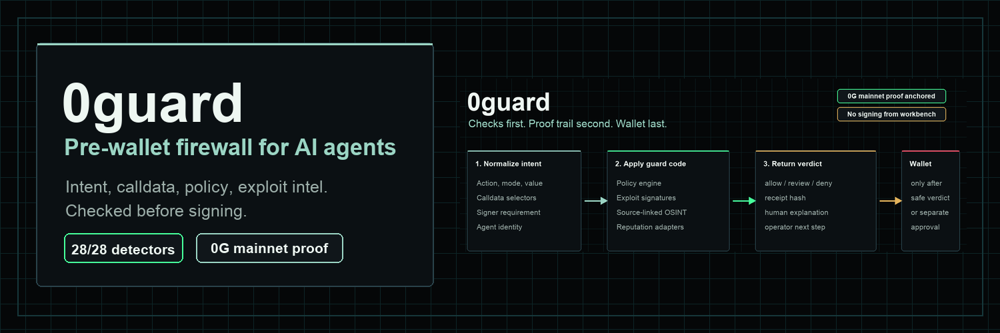

# 0guard

> Pre-wallet firewall for AI agents. 0guard checks intent, calldata,
> reputation context, and exploit intelligence before any wallet, signer,
> bridge, payment rail, exchange action, or Telegram send can act.

[](https://github.com/arigatoexpress/0guard/actions)
[](LICENSE)
[](https://chainscan.0g.ai/tx/0x64ff260ccd02aa69fc18d5727eb4530d8774003bc7df63ec7d5cda036fc438ed)



0guard is a security layer for autonomous agents and wallet-connected apps.
Instead of waiting for a wallet prompt, it reviews the action first. The
current build returns `allow`, `review`, or `deny` verdicts, produces
deterministic receipts, exposes source-linked incident intelligence, and
anchors one deny receipt on 0G mainnet.

The repo is deliberately proof-first: no private keys, no signing, no
broadcasting, no bridges, no swaps, no x402 settlement, no exchange orders, and
no outbound Telegram messages from the workbench.

## Judge Fast Path

| Step | What to open | What it proves |
| --- | --- | --- |
| 1 | [Public proof hub](https://arigatoexpress.github.io/0guard/hackathon-0g/) | Main judge surface with the product story, proof links, dataset stats, and safety boundaries. |
| 2 | [0G mainnet anchor tx](https://chainscan.0g.ai/tx/0x64ff260ccd02aa69fc18d5727eb4530d8774003bc7df63ec7d5cda036fc438ed) | A real 0G mainnet transaction anchoring a critical `deny` receipt. |
| 3 | [Mainnet proof JSON](https://arigatoexpress.github.io/0guard/hackathon-0g/mainnet-proof.json) | Contract, deploy tx, anchor tx, receipt hash, and JSON-RPC readback evidence. |
| 4 | [Hosted Telegram Mini App preview](https://guard0-miniapp-s77j6bxyra-uc.a.run.app/telegram) | Mobile wallet-alert UX and Mira explanation preview with sends disabled. |
| 5 | [Hosted readiness API](https://guard0-miniapp-s77j6bxyra-uc.a.run.app/api/readyz) | Live operational posture, mainnet verifier config, detector coverage, and no-side-effect safety flags. |
| 6 | Run `pytest -q` locally | Regression proof for policy, data, public docs, app routes, and integration contracts. |

## Mainnet Proof

| Field | Value |
| --- | --- |
| Network | 0G mainnet |
| Chain ID | `16661` |
| RPC | `https://evmrpc.0g.ai` |
| Contract | [`0xBaC59b1571b7c7195915c5B36D8A719Ed7182abc`](https://chainscan.0g.ai/address/0xBaC59b1571b7c7195915c5B36D8A719Ed7182abc) |
| Deploy tx | [`0xd4c1d5f947cb7bae14c581072602976f14fdfaab1474c9fd7bd4d87fa0f5303b`](https://chainscan.0g.ai/tx/0xd4c1d5f947cb7bae14c581072602976f14fdfaab1474c9fd7bd4d87fa0f5303b) |
| Anchor tx | [`0x64ff260ccd02aa69fc18d5727eb4530d8774003bc7df63ec7d5cda036fc438ed`](https://chainscan.0g.ai/tx/0x64ff260ccd02aa69fc18d5727eb4530d8774003bc7df63ec7d5cda036fc438ed) |
| Anchored receipt | `0x9739dbd4afb6ab21f15ccb634b49dabc9144550ef06d346cb4e7cd363e74afd1` |
| Decision | `deny`, severity `critical`, agent `agent-7857-demo` |

The public proof file stores both `0x`-prefixed transaction hashes and bare hash
aliases for compatibility. Explorer links use the `0x` form because that is the
format accepted by 0G Chain Scan.

## What Is Live

| Capability | Status | Proof route or file |
| --- | --- | --- |
| Intent firewall | Live | `POST /api/evaluate`, `POST /api/native-preflight` |
| Threat case file | Live preview, no side effects | `POST /api/threat-case-file` |
| Incident intelligence | Live | `GET /api/data/summary`, `GET /api/data/provenance`, `GET /api/data/signature-map` |
| Detector coverage | Live | 28 of 28 incident-derived seeds covered; `coverageRatio: 1.0` |
| 0G Chain receipt anchor | Live on mainnet | `docs/hackathon-0g/mainnet-proof.json` |
| 0G Storage receipts | Storage-ready, not auto-uploaded | `zero_g.storage_receipt.root_hash` from `/api/evaluate` |
| 0G Compute | Planned adapter, not claimed live | Stated in `docs/hackathon-0g/mainnet-gap-register.md` |
| Reputation layer | Live derived normalizer and shadow cache | `/api/reputation/*` routes |
| Telegram Mini App | Live preview, no outbound sends | `/telegram`, `/api/telegram/miniapp/preview` |
| Cross-chain guardrails | Live read-only catalog | `/api/integrations/cross-chain`, `/api/integrations/external-guardrails` |
| Developer kit | Live | `/api/developer-kit`, `examples/native_preflight/` |

## Why It Matters

AI agents are gaining wallet, bridge, payment, exchange, and social-channel
tooling faster than their safety controls are maturing. A bad agent action can
be formed before a human sees a wallet prompt.

0guard moves the checkpoint earlier:

1. Parse the proposed agent action.
2. Check policy, calldata selectors, mode, value, and intent language.
3. Add source-linked exploit intelligence and reputation context.
4. Return `allow`, `review`, or `deny`.
5. Produce a deterministic receipt that can be anchored or stored through 0G.

The product wedge is simple: agents should prove an action is safe before they
ask a signer to trust them.

## Built-In Intelligence

The April 2026 dataset is validated, source-linked, fingerprinted, and exposed
through public read-only APIs. Current repo truth:

| Metric | Value |
| --- | --- |
| Incidents | 28 |
| Reported losses covered | `$634,862,000` |
| Detector coverage | 28 of 28 incident-derived seeds |
| Source registry | 30 tracked source lanes |
| Provenance coverage | 1.0 without live fetches |
| Raw upstream payload resale | Disabled |

Examples of promoted detector categories include durable nonce/social
engineering, unsafe-cast math, UUPS/admin upgrade compromise, bridge message
forgery, EIP-712 replay, EIP-7702 delegated batch-call access-control failure,
first-depositor vault inflation, router quote mismatch, oracle/fee
misconfiguration, and bridge control risk.

## Architecture

```text
AI agent or wallet app
        |
        v
0guard native preflight
        |
        +-- policy engine: mode, signer need, value, approval, bridge, send
        +-- exploit signatures: calldata selectors and behavioral patterns
        +-- reputation layer: domains, counterparties, source evidence
        +-- incident intelligence: source-linked exploit corpus
        |
        v
allow / review / deny verdict
        |
        +-- 0G Chain receipt anchor payload
        +-- 0G Storage-ready root hash
        +-- Telegram/Mira alert preview
        +-- developer-kit response for agents, CI, wallets, and Mini Apps
```

## Quickstart

```bash
git clone https://github.com/arigatoexpress/0guard.git
cd 0guard
python3 -m venv .venv
source .venv/bin/activate
python3 -m pip install -e '.[dev]'
python3 -m guard0.app
```

Open `http://127.0.0.1:8109` for the local dashboard.

## Try The Core Flow

```bash
curl -s -X POST http://127.0.0.1:8109/api/evaluate \
  -H "Content-Type: application/json" \
  -d '{
    "intent": {
      "action": "approve",
      "mode": "live_transaction",
      "requires_signature": true,
      "calldata": "0x095ea7b3ffffffffffffffffffffffffffffffffffffffffffffffffffffffffffffffff"
    },
    "enable_0g_anchor": true,
    "enable_0g_storage": true,
    "agent_id": "agent-7857-demo"
  }' | python3 -m json.tool
```

Useful local readbacks:

```bash
curl -s http://127.0.0.1:8109/api/readyz | python3 -m json.tool
curl -s http://127.0.0.1:8109/api/product/brief | python3 -m json.tool
curl -s http://127.0.0.1:8109/api/hackathon/threat-passport | python3 -m json.tool
curl -s http://127.0.0.1:8109/api/data/detection-coverage | python3 -m json.tool
curl -s http://127.0.0.1:8109/api/reputation/shadow-cache | python3 -m json.tool
```

CLI equivalents:

```bash
python3 -m guard0.cli evaluate \
  --intent-json '{"action":"approve","mode":"live_transaction","requires_signature":true,"calldata":"0x095ea7b3ffffffffffffffffffffffffffffffffffffffffffffffffffffffffffffffff"}'

python3 -m guard0.cli native-preflight \
  --payload-json '{"surface":"evm","operation":"read_status","chain":"eip155:16661"}'

python3 -m guard0.cli proof-ladder \
  --payload-json '{"chain":"eip155:16661","intent":{"action":"approve","mode":"live_transaction","requires_signature":true}}'
```

## API Map

| Area | Routes |
| --- | --- |
| Runtime | `/api/health`, `/api/healthz`, `/api/readyz`, `/api/product/brief` |
| Policy | `/api/evaluate`, `/api/hack-check`, `/api/native-preflight` |
| 0G | `/api/0g/status`, `/api/0g/receipt`, `/api/0g/proof-ladder` |
| Data | `/api/data/summary`, `/api/data/incidents`, `/api/data/provenance`, `/api/data/detection-coverage`, `/api/data/signature-map` |
| OSINT | `/api/osint/sources`, `/api/osint/readiness`, `/api/osint/signals`, `/api/intelligence/*` |
| Reputation | `/api/reputation/probe`, `/api/reputation/connectors`, `/api/reputation/adapters`, `/api/reputation/shadow-cache` |
| Telegram/Mira | `/telegram`, `/api/telegram/*`, `/api/mira/claim-preview` |
| Integrations | `/api/integrations/cross-chain`, `/api/integrations/metamask`, `/api/integrations/arbitrum`, `/api/integrations/ika`, `/api/integrations/external-guardrails` |
| Judge packet | `/api/hackathon/submission-brief`, `/api/hackathon/submission-packet`, `/api/hackathon/readiness`, `/api/hackathon/threat-passport` |
| Developer kit | `/api/developer-kit`, `examples/native_preflight/` |

## Repository Guide

| Path | Purpose |
| --- | --- |
| `src/guard0/` | Flask app, CLI, policy engine, signatures, OSINT, reputation, Telegram, and integration routes. |
| `contracts/` and `foundry/` | 0G mainnet receipt-anchor Solidity source and build artifacts. |
| `data/april_2026_incidents.json` | Source-linked incident dataset used for detector coverage. |
| `data/osint_sources.json` | Rights-aware source registry and output policy. |
| `docs/hackathon-0g/mainnet-proof.json` | Canonical 0G mainnet contract, deploy tx, anchor tx, and RPC readback proof. |
| `docs/hackathon-0g/mainnet-gap-register.md` | Honest live-vs-planned status for Chain, Storage, Compute, Telegram, and mainnet operations. |
| `docs/hackathon-0g/assets/README.md` | Public media registry. Submitted video assets are archived behind proof links, not used as the main proof. |
| `docs/LEGAL_AND_ASSET_POLICY.md` | Source rights, generated media, and raw-payload safety policy. |

## What Not To Claim

- No live 0G Compute inference is enabled yet.
- No live 0G Storage upload/readback is enabled by default.
- No browser or Mini App path signs, broadcasts, swaps, bridges, settles, or
  places exchange orders.
- No outbound Telegram send is enabled from the judge workbench.
- No raw paid-feed or upstream OSINT payloads are resold or mirrored.
- The submitted MP4 remains as archive continuity; the canonical public proof
  is the mainnet transaction, proof JSON, API/readiness readbacks, and source
  data.

## Tests

```bash
pytest -q
python3 -m compileall src scripts
ruff check src tests scripts
python3 scripts/browser_smoke.py
gitleaks detect --no-git --source . --redact --verbose
```

## License And Source Rights

0guard is Apache-2.0. See [LICENSE](LICENSE), [NOTICE](NOTICE), and
[docs/LEGAL_AND_ASSET_POLICY.md](docs/LEGAL_AND_ASSET_POLICY.md).

Public intelligence outputs are derived-analysis-first: source references,
hashes, summaries, and defensive findings are allowed; raw upstream payload
resale is not.
