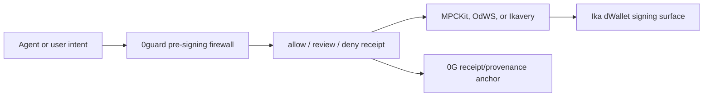

# Ika, Encrypt, and Ikavery Integration Plan

This pass studied these public repos:

- `Iamknownasfesal/ikavery`: quorum-gated key import and asset recovery UX for
  Sui testnet and Solana devnet.
- `Iamknownasfesal/mpckit`: hosted/self-hostable dWallet signing API.
- `Iamknownasfesal/odws`: Open dWallet Standard SDK and on-chain policy engine.
- `Iamknownasfesal/clear-msig-ika`: human-readable Solana multisig intents that
  execute through Ika dWallets.
- `dwallet-labs/ika`: core Ika 2PC-MPC dWallet network.
- `dwallet-labs/encrypt-pre-alpha`: Solana devnet FHE SDK and mock executor.

## Product Fit

Ika and Ikavery are not "bridge" integrations. They fit 0guard because they
sign native transactions on the destination chain. 0guard should sit before
that signature request:

The core story becomes:

1. 0guard explains and blocks unsafe intent.
2. Ika enforces zero-trust dWallet signing.
3. Ikavery provides a recovery/quorum UX for testnet/devnet demos.
4. 0G remains the receipt and provenance layer.

## What We Added

- `GET /api/integrations/ika`: source-cited manifest for Ika, Encrypt,
  Ikavery, MPCKit, OdWS, and clear-msig-ika.
- `POST /api/integrations/ika/evaluate`: read-only dWallet signing preflight.
- Dashboard button: `Ika dWallets`.
- Cross-chain catalog targets:
  - `ika_dwallets`
  - `ikavery_recovery`
  - `encrypt_pre_alpha`
- External guardrail target: `ika_dwallets`.

## Guardrails

- No private-key import from 0guard.
- No dWallet creation from 0guard.
- No MPCKit/OdWS signing from 0guard.
- No Ikavery sweeps from 0guard.
- No Solana/Sui transaction submission from 0guard.
- Encrypt pre-alpha must be treated as public/plaintext; do not put sensitive
  data into it until its own guarantees change.

## Rights Boundary

Some friend repos do not declare a license in GitHub metadata. Treat them as
architecture references unless Fesal adds a license or gives written permission.
MPCKit and OdWS do have permissive licenses and are better candidates for future
SDK/API adapters.

## Next Build

1. Add a small TypeScript example that calls 0guard before MPCKit `/v1/sign`.
2. Add an OdWS `PolicyFunction` example that delegates to 0guard.
3. Add an Ikavery "0guard receipt" panel beside recovery/sweep proposals.
4. Revisit Encrypt only when pre-alpha no longer says plaintext.
